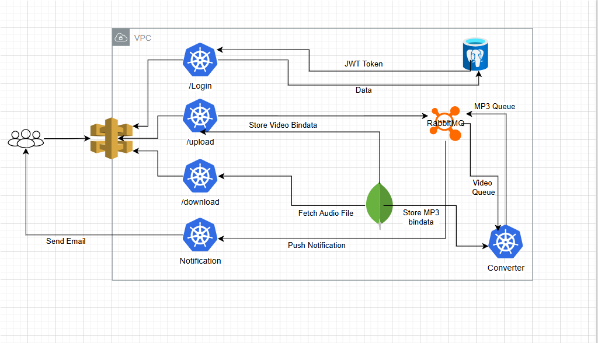

# DevOps Project: Video Converter

A microservices-based application for converting MP4 videos to MP3 files, designed for deployment on AWS EKS.

## Table of Contents

- [Architecture](#architecture)
- [Prerequisites](#prerequisites)
- [Deployment Guide](#deployment-guide)
  - [Part 1: AWS Infrastructure Setup](#part-1-aws-infrastructure-setup)
  - [Part 2: Application Deployment](#part-2-application-deployment)
- [Validation](#validation)
- [Usage: API Endpoints](#usage-api-endpoints)
- [Destroying the Infrastructure](#destroying-the-infrastructure)

## Architecture
The application is composed of four main microservices:
- **auth-server**
- **converter-module**
- **database-server** (PostgreSQL and MongoDB)
- **notification-server**

<p align="center">
  
</p>

## Prerequisites
Before starting the deployment, ensure the following tools are installed and accounts are set up:

- **AWS Account**: An active AWS account is required.
- **AWS CLI**: Installed and configured.
- **kubectl**: Kubernetes command-line tool.
- **Helm**: Kubernetes package manager.
- **Python**: Installed on your system.

## Deployment Guide
This guide provides step-by-step instructions to deploy the application on AWS EKS.

### Part 1: AWS Infrastructure Setup

#### Create EKS Cluster IAM Role
- Create an IAM role named `eksCluster` for the EKS service.
- Attach the `AmazonEKS_CNI_Policy` to this role.

#### Create EKS Node IAM Role
- Create an IAM role named `AmazonEKSNodeRole` for worker nodes.
- Attach these policies:
  - `AmazonEKS_CNI_Policy`
  - `AmazonEBSCSIDriverPolicy`
  - `AmazonEC2ContainerRegistryReadOnly`

#### Create the EKS Cluster
- Navigate to the EKS service in the AWS Console.
- Provide a cluster name.
- Configure networking (VPC and subnets).
- Assign the `eksCluster` IAM role.
- Wait until the status becomes **Active**.

#### Create a Node Group
- In the cluster's **Compute** section, choose **Add node group**.
- Configure with AMI, instance type (e.g., `t3.medium`), and number of nodes.

#### Configure Security Group
- Navigate to the security group for your nodes.
- Add inbound rules for required ports.

#### Enable EBS CSI Add-on
- After cluster creation, enable the EBS CSI add-on for PVC support.

### Part 2: Application Deployment

#### Clone the Repository
Clone the project repository locally.

#### Configure kubectl
Run the following to connect to the EKS cluster:
```bash
aws eks update-kubeconfig --name <cluster_name> --region <aws_region>
```

#### Deploy Dependencies with Helm
**MongoDB:**
```bash
cd Helm_charts/MongoDB
# Set username/password in values.yaml
helm install mongo .
```

**PostgreSQL:**
```bash
cd ../Postgres
# Set username/password in values.yaml
helm install postgres .
```
Initialize the database using `init.sql`.

**RabbitMQ:**
```bash
helm install rabbitmq .
```
Access the dashboard via `<nodeIp>:30004` (default: `guest/guest`). Create queues `mp3` and `video`.

#### Configure and Deploy Microservices
**Notification Service Secrets:**
- Enable 2FA on your Google Account.
- Generate an App Password.
- Add it and your email to `notification-service/manifest/secret.yaml`.

**Converter Service Secrets:**
- Provide your email and password in `converter-service/manifest/secret.yaml`.

**Apply Manifests:**
```bash
kubectl apply -f .
```
Apply in each manifest directory:
- `auth-service/manifest`
- `gateway-service/manifest`
- `converter-service/manifest`
- `notification-service/manifest`

## Validation
Check status of all components:
```bash
kubectl get all
```
All pods should be in **Running** state.

## Usage: API Endpoints
Replace `nodeIP` with the public IP of an EKS worker node.

### Login Endpoint
**Request:**
```
POST http://nodeIP:30002/login
```
**Example:**
```bash
curl -X POST http://nodeIP:30002/login -u <email>:<password>
```

### Upload Endpoint
**Request:**
```
POST http://nodeIP:30002/upload
```
**Example:**
```bash
curl -X POST -F 'file=@./video.mp4' -H 'Authorization: Bearer <JWT Token>' http://nodeIP:30002/upload
```
You will receive an email with the file ID.

### Download Endpoint
**Request:**
```
GET http://nodeIP:30002/download?fid=<Generated file identifier>
```
**Example:**
```bash
curl --output video.mp3 -X GET -H 'Authorization: Bearer <JWT Token>' "http://nodeIP:30002/download?fid=<Generated fid>"
```

## Destroying the Infrastructure
To prevent ongoing AWS charges:

1. Delete the Node Group associated with your cluster.
2. Delete the EKS Cluster after the nodes are removed.